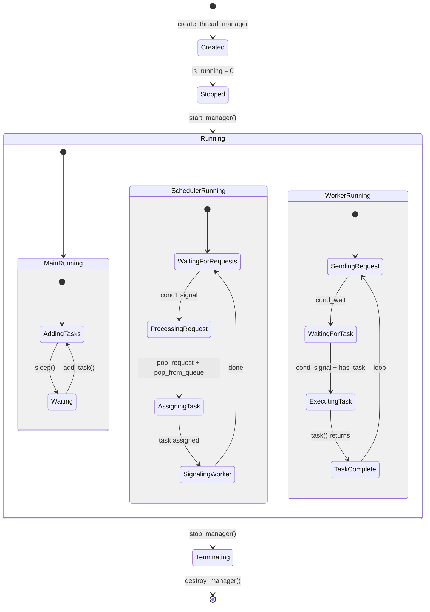

# Thread Manager with Task Queue

A multithreaded task scheduling system in C++ that manages a worker thread pool with a request-based task distribution mechanism, accompanied by a Python-based real-time thread monitoring GUI.

---

## Table of Contents

- [Overview](#overview)
- [Architecture](#architecture)
- [Components](#components)

---

## Overview

This project implements a **producer-consumer pattern** with a centralized task queue and a scheduler thread that distributes tasks to worker threads on demand. Workers request tasks when idle, and the scheduler assigns them from the queue.

---

## Architecture

## Components
- **ThreadManager** - Main controller managing worker threads, queues, and scheduler
- **Task Queue** - FIFO queue storing tasks (`TaskFunc` function pointers)
- **Request Queue** - Queue storing pending task requests from worker threads
- **Scheduler Thread** - Processes worker requests and assigns tasks from main queue
- **Worker Threads** - Execute computational tasks and request new work when idle